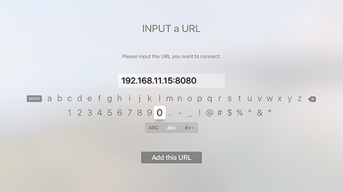

# Air Launcher Server

## バイナリから実行

**バイナリをダウンロードして展開**

以下から環境に合ったzipファイルをダウンロードしてください。

* [OS X](http://nagisaworks.com/airlauncher/osx.zip)
* [Linux (64bit)](http://nagisaworks.com/airlauncher/linux64.zip)
* [Windows (32bit)](http://nagisaworks.com/airlauncher/windows32.zip)
* [Windows (64bit)](http://nagisaworks.com/airlauncher/windows64.zip)
* [Raspbian (Raspberry Pi B+)](http://nagisaworks.com/airlauncher/raspbian.zip)


zipファイルの中身は以下のとおりです。適当な場所へ展開してください。

```
/
├── fileserve (.exe) 
├── list.xml
└── meta.json
```

`list.xml` はファイルサーバーのルートへコピーしてください。`meta.json`はAir Launcher上でサーバー名・画像を任意のものに設定したい場合、編集して同じくルートへコピーします。

**実行**

ルートディレクトリ及びポートなどを確認のうえで、ターミナル/コンソール/PowerShell等を用いてfileserveを実行します。

~/media をルートとする場合は以下のように実行します。ポートは指定しない場合、**8080**となります。

```
$ ./fileserve /media
```

ポートを指定する場合、-p オプションで指定します。 例えば2100を指定するなら、以下のようになります。


```
$ ./fileserve -p 2100 /media
```

実行するとIPアドレスとポート番号が表示されます。


**Air Launcherにサーバーを追加**

Apple TV上のAir Launcherを起動し、「サーバーの追加」を選びアドレス（`192.168.1.10:8080` など）を入力してください。


状況に合わせて、サーバーやルータのポートを開放してください。

---

## ソースから実行

まず[Go言語](https://golang.org/)をインストールしてください。インストール方法はここでは省略します。Homebrewをご利用であれば、`$ brew install go`が簡単です。

[**ソースコードをダウンロード**](http://nagisaworks.com/airlauncher/server.zip)

サーバーには以下の3つが含まれています。

```
server/
├── fileserve/
├── static/
└── tvjs/
```


#### fileserve/

ファイルサーバーのソースコードです。

```
$ cd fileserve
$ go run fileserve.go
```

#### static/
TVMLと呼ばれるtvOS用の特殊なXMLのサンプル集です。
 
```
$ cd static
$ go run main.go
```

#### tvjs/
tvOS用のJavaScriptを実行するサンプルです。

```
$ cd tvjs
$ go run main.go
```


#### カスタマイズ
各サンプルを元に、それぞれの環境や用途に応じたサーバーを作成できます。Go言語のクロスコンパイルを使用すると、各環境に応じた実行ファイルを作成できます。

```
$ go build fileserve.go
$ GOOS=linux GOARCH=amd64 go build fileserve.go //for linux
$ GOOS=linux GOARCH=arm GOARM=5 go build fileserve.go //for Rapbian on Raspberry Pi B+
```

Go言語のクロスコンパイルについての詳細はWeb検索等で補ってください。

---

## Air Launcher について

Air LauncherはWebブラウザのように、サーバーからXMLやJavaScriptを提供するだけでApple TVに表示を行うアプリケーションです。

### XML (TVML)

XMLはTVMLというAppleの用意したXMLの仕様に従って記述します。詳細は公式の[tvOSドキュメント](https://developer.apple.com/tvos/documentation/)を参照してください。

Air Launcherでは、選択されるXMLタグのアトリビュートを記述することで、ページの遷移やビデオ・音楽の再生を行います。


```
<list>
	<listItemLockup type="video" url="http://example.com/video.mp4">
		<title>My Video</title>
	</listItemLockup>
	<listItemLockup url="http://example.com/next.xml">
		<title>Next Page</title>
	</listItemLockup>
</list>
```

アトリビュートは`url`と`type`の2つで、組み合わせて使用します。

#### url
遷移先のURLを指定します。

Value|Description
--|--
string|遷移先のURL

#### type

Value | Description
---|----
指定なし | 画面遷移 (`pushDocument`)
modal | Modalで遷移 (`presentModal`)
video | 動画を再生 兄弟ノードをPlaylistへ追加
audio | 音声を再生 兄弟ノードをPlaylistへ追加

動画・音声の再生はApple TVの仕様によります。動画であればmp4, mov, m4vなど、音声であれば、mp3やm4aなどです。


### JavaScript

JavaScriptを直接実行します。一部のDOMクラスとTVJSフレームワークが利用できます。詳細は公式の[tvOSドキュメント](https://developer.apple.com/tvos/documentation/)を参照してください。

Air Launcherで登録するURLには、`.js`まで指定してください。末尾が`.js`であるときのみ、JavaScriptとして実行し、それ以外ではXMLとして処理されます。

JavaScriptはグローバルとして処理を開始します。`App.onLaunch`は不要です。

Appに渡されるOptionsは、globalで変数`appOptions`として定義してあります。
実行されるJavaScriptのURLは`appOptions.reloadData.url`で取得できます。

### meta-data

サーバー一覧に表示される名称・サムネイルを変更できます。

サーバーのルートまたはJavaScriptと同一ディレクトリに、JSONファイルを次の名前で設置してください。

* XMLの場合 `meta.json`
* JavaScriptの場合 `Your-JS-filename.json`

Key | Description
---|---
name | リストに表示するサーバー名
thumb | リスト右に表示するサムネイル（フルパス）


例

```
{
  "name":"JS test server",
  "thumb":"http://example.com/thumb.png"
}
```


---

## Execute binary

**Download and unzip file**

Download a zip file.

* [OS X](http://nagisaworks.com/airlauncher/osx.zip)
* [Linux (64bit)](http://nagisaworks.com/airlauncher/linux64.zip)
* [Windows (32bit)](http://nagisaworks.com/airlauncher/windows32.zip)
* [Windows (64bit)](http://nagisaworks.com/airlauncher/windows64.zip)
* [Raspbian (Raspberry Pi B+)](http://nagisaworks.com/airlauncher/raspbian.zip)


The contents of zip are as following.


```
/
├── fileserve (.exe) 
├── list.xml
└── meta.json
```

Copy `list.xml` to your server root dir. If you want to modify the server name and thumbnail on Air Launcher, edit and copy `meta.json` to the same.


**Running**

Make sure the root path and port, then run "fileserve" with Terminal/Console/PowerShell.

For example, ~/media for the root, do like this. The default port is **8080**.

```
$ ./fileserve /media
```

To use specific port number, input with -p option. E.g. using 2100 on the following.

```
$ ./fileserve -p 2100 /media
```

Then, display IP Address and port number will come up on screen.


**Adding the server to Air Launcher**

Launch Air Launcher on your Apple TV. Choose "Add Server" and input the server address (e.g. `192.168.1.10:8080`).



Please open the port on a server or a router if you need.


## Running with source code.

At first, install Golang(https://golang.org/). If you using Homebrew, `$ brew install go` is simple way.

[**Download source code**](http://nagisaworks.com/airlauncher/server.zip)

You'll see something like this:

```
server/
├── fileserve/
├── static/
└── tvjs/
```

	
#### fileserve/

Source code for file server.

```
$ cd fileserve
$ go run fileserve.go
```

#### static/

Samples of Apple's Television Markup Language (TVML).

 
```
$ cd static
$ go run main.go
```


#### tvjs/

Samples of running tvOS's JavaScript

 
```
$ cd tvjs
$ go run main.go
```


#### Customize

It is possible to build your own server app conforming your usage. Cross-Compiling go code is useful to generate a binary.

```
$ go build fileserve.go
$ GOOS=linux GOARCH=amd64 go build fileserve.go //for linux
$ GOOS=linux GOARCH=arm GOARM=5 go build fileserve.go //for Rapbian on Raspberry Pi B+
```


## About Air Launcher

Just providing XML and JavaScript with a server, Air Launcher displays on Apple TV like a web browser.

### XML (TVML)

Writing XML according to TVML designed by Apple. For the detail, check [tvOS documentation](https://developer.apple.com/tvos/documentation/).

Air Launcher recognize the attribute with selectable elements to provide navigation and playing video/audio.


```
<list>
	<listItemLockup type="video" url="http://example.com/video.mp4">
		<title>My Video</title>
	</listItemLockup>
	<listItemLockup url="http://example.com/next.xml">
		<title>Next Page</title>
	</listItemLockup>
</list>
```

Attributes are 'url' and 'type' combinations.

#### url

Indicate a destination url.

Value|Description
---|---
string|Destination URL

### type

Value|Description
---|---
Not set| goes to url (`pushDocument`)
modal|displays modal(`presentModal`)
video|plays movie, pushes siblings to playlist
audio|plays audio, pushes siblings to playlist

To play movie or audio are based on Apple TV's specs (e.g. mp4, mov, m4v, mp3 and m4a)

### JavaScript

Directory executing JavaScript code. You can use some DOM classes and TVJS framework. See [tvOS documentation](https://developer.apple.com/tvos/documentation/) for further information.

You need to register a URL incorporating a extension `.js`.  If the end of URL is `.js`, Air Launcher processes as a JavaScript, and if the other,  it handles for XML.

Processing begins in global scope. It is unnecessary `App.onLaunch`.


It has been defining `appOptions` as a global variable for App's Options.
You can get the JS URL with `appOptions.reloadData.url`.

### meta-data

It is able to change a name and thumbnail on the server list.

Putting on JSON file in server-root or JavaScript's directory of the name of the following.

* for XML `meta.json` 
* for JavaScript `Your-JS-filename.json`

Key|Description
---|---
name|Server name you want to display
thumb|Server thumbnail at right side of the list (Full path)

e.g.


```
{
  "name":"JS test server",
  "thumb":"http://example.com/thumb.png"
}
```
